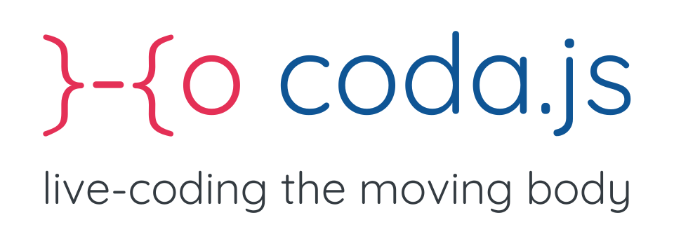

**coda.js** is a Javascript library and live-coding environment for designing movement-based interactions in the browser.

**coda.js** integrates a number of modules for movement sensing (with wrappers for common devices such as the Myo Armband or the Leap Motion), movement signal processing (from low-level analysis blocks and filters to more advanced representations such as the wavelet transform), mapping tools (from direct mapping to machine learning-based recognition and regression), as well as some sound synthesis and effect engines.

### Features

- **Fully Reactive**
  coda.js relies on the most.js reactive programming library, allowing for easy asynchronous data stream processing.
- **Compact Syntax**
  coda.js was designed with a compact syntax allowing for extremely rapid prototyping of movement-based interactions.
**Multiple Devices**
  coda.js integrates binding to several commercial sensing devices such as the Myo armband or the Leap Motion, and easily communicates with Cycling'74 Max 8
- **Low-level Signal Processing**
- **Movement Data Visualisation**
- **Interactive Machine Learning**
- **Sound Synthesis**

### Getting Started with the Live-Coding environment

Just get to [https://animacoda.netlify.com](https://animacoda.netlify.com) and start playing!

### Installing and integrating coda.js

##### Browser

Just grab the full library and start playing:
```
<script src="https://codajs.netlify.com/coda.js"></script>
```

##### Node.js

[TODO]

### Why coda.js ?

The coda.js library emerged in the context of the CO/DA research project at [LIMSI-CNRS](https://www.limsi.fr), that focuses on live-coding as a practice for improvisation in interactive dance. The project aims develop a set of tools for prototyping movement-based interactions on the fly, while a dancer is improvising.

### Credits

CO/DA has been developed at [LIMSI-CNRS](https://www.limsi.fr/en/) by [Jules Françoise](https://www.julesfrancoise.com), and is released under the MIT Licence. The CO/DA project is funded by Réseau Francilien en Sciences Informatiques ([DIM RFSI](https://dim-rfsi.fr/)) of the French Ile-de-France region (2018).

**Contributors:**
- Jules Françoise
- Lucie Van Nieuwenhuyze

Coda would not exist without the tremendous work of other open-source contributors. In particular, coda heavily relies on several open-source libraries:
- [Most](https://github.com/mostjs/core): Monadic Event Stream
- [Vue](https://vuejs.org): The Progressive JavaScript Framework
- [Waves-LFO](https://github.com/wavesjs/waves-lfo): Ircam's Low Frequency Operators
- [Tonal](https://github.com/danigb/tonal): A functional music theory library for Javascript
- [complex-js](https://github.com/patrickroberts/complex-js): JavaScript Complex Math
- [myo.js](https://github.com/thalmiclabs/myo.js): Myo javascript bindings
- [Codemirror](http://codemirror.net/): a versatile text editor implemented in JavaScript for the browser
